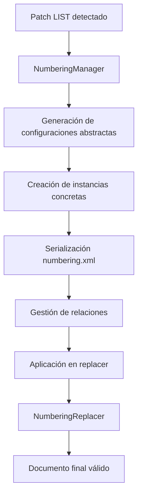

<p align="center">
    
</p>

<p align="center">
    Easily generate and modify .docx files with JS/TS. Works for Node and on the Browser.
</p>

---

[![NPM version][npm-image]][npm-url]
[![Downloads per month][downloads-image]][downloads-url]
[![GitHub Action Workflow Status][github-actions-workflow-image]][github-actions-workflow-url]
[![Known Vulnerabilities][snky-image]][snky-url]
[![PRs Welcome][pr-image]][pr-url]
[![codecov][codecov-image]][codecov-url]
[![Docx.js Editor][docxjs-editor-image]][docxjs-editor-url]

# Informe Completo: Implementación de Listas Numeradas en el Patcher API de docx

## Resumen Ejecutivo

Se implementó exitosamente un sistema completo de listas numeradas y con viñetas para el patcher API de docx, permitiendo la creación dinámica de listas en documentos template. Esta funcionalidad extiende significativamente las capacidades del patcher, que anteriormente solo soportaba reemplazo de texto y párrafos.

## Estructura 
```
.
├── content-types-manager.ts
├── from-docx.ts
├── index.ts
├── list-patch-types.ts
├── numbering-manager.ts
├── paragraph-split-inject.ts
├── paragraph-token-replacer.ts
├── patch-detector.ts
├── relationship-manager.ts
├── replacer.ts
├── run-renderer.ts
├── traverser.ts
└── util.ts
---
.
├── content-types-manager.spec.ts
├── content-types-manager.ts
├── from-docx.spec.ts
├── from-docx.ts
├── index.ts
├── list-patch-detection.spec.ts
├── list-patch-types.ts
├── numbering-manager.spec.ts
├── numbering-manager.ts
├── numbering-relationships.spec.ts
├── numbering-serialization.spec.ts
├── paragraph-split-inject.spec.ts
├── paragraph-split-inject.ts
├── paragraph-token-replacer.spec.ts
├── paragraph-token-replacer.ts
├── patch-detector.spec.ts
├── patch-detector.ts
├── patch-lists.spec.ts
├── relationship-manager.spec.ts
├── relationship-manager.ts
├── replacer.spec.ts
├── replacer.ts
├── run-renderer.spec.ts
├── run-renderer.ts
├── traverser.spec.ts
├── traverser.ts
├── util.spec.ts
└── util.ts
```

## Problema Resuelto

**Problema Principal**: El patcher API de docx no tenía soporte para crear listas numeradas o con viñetas dinámicamente en documentos template. Los usuarios solo podían insertar texto plano o párrafos individuales, pero no estructuras de lista complejas.

**Desafíos Técnicos Específicos**:
1. Generación dinámica de configuraciones de numeración OOXML
2. Serialización correcta del archivo `numbering.xml`
3. Gestión de relaciones entre archivos XML
4. Sincronización de referencias temporales con IDs numéricos finales
5. Preservación del contenido original de párrafos en listas

## Arquitectura de la Solución

### Flujo de Procesamiento


## Archivos Creados y Modificados

### Archivos Nuevos Creados

#### 1. `list-patch-types.ts`
**Propósito**: Define los tipos TypeScript para patches de lista
**Funcionalidad**:
- Define la interfaz `IListPatch` con propiedades como `listType`, `level`, `startNumber`
- Establece tipos de unión para `"numbered" | "bullet"`
- Proporciona validación de tipos en tiempo de compilación

#### 2. `numbering-manager.ts`
**Propósito**: Gestiona la generación y configuración de numeración OOXML
**Funcionalidades Clave**:
- `generateNumberingFromPatches()`: Crea configuraciones abstractas de numeración
- `createConcreteInstances()`: Genera instancias concretas con IDs únicos
- `getNumbering()`: Retorna el objeto Numbering serializable
- Maneja tanto listas numeradas como con viñetas

#### 3. `numbering-manager.spec.ts`
**Propósito**: Tests unitarios para NumberingManager
**Cobertura**:
- Generación de configuraciones para diferentes tipos de lista
- Creación de instancias concretas
- Validación de estructura OOXML generada

#### 4. `list-patch-detection.spec.ts`
**Propósito**: Tests para detección de patches de lista
**Validaciones**:
- Identificación correcta de patches tipo LIST
- Diferenciación entre tipos de lista
- Manejo de casos edge

#### 5. `numbering-serialization.spec.ts`
**Propósito**: Tests de serialización XML
**Verificaciones**:
- Generación correcta de `numbering.xml`
- Estructura OOXML válida
- Elementos `w:abstractNum` y `w:num` correctos

#### 6. `numbering-relationships.spec.ts`
**Propósito**: Tests de gestión de relaciones
**Validaciones**:
- Creación de relaciones en `document.xml.rels`
- Content types correctos en `[Content_Types].xml`
- Referencias válidas entre archivos

#### 7. `patch-lists.spec.ts`
**Propósito**: Tests de integración end-to-end
**Cobertura Completa**:
- Flujo completo de procesamiento de listas
- Listas numeradas y con viñetas
- Contenido mixto y casos complejos
- Validación de documentos Word válidos

### Archivos Modificados

#### 1. `from-docx.ts` - Modificaciones Principales
<cite>src/patcher/from-docx.ts:24-27</cite>

**Cambios Implementados**:
- **Nuevo PatchType.LIST**: Añadido soporte para `PatchType.LIST = "list"`
- **Detección de patches de lista**: Lógica para identificar y procesar patches tipo LIST
- **Integración con NumberingManager**: Creación y gestión del NumberingManager
- **Mapa de referencias**: Sistema para sincronizar referencias temporales con IDs finales
- **Serialización de numbering.xml**: Generación del archivo de numeración
- **Gestión de relaciones**: Creación automática de relaciones y content types
- **Aplicación de NumberingReplacer**: Conversión de referencias temporales a IDs numéricos

**Flujo de Procesamiento Añadido**:
```typescript
// Detección de patches de lista
const listPatches: Record<string, IListPatch> = {};
for (const [key, patch] of Object.entries(patches)) {
    if (isListPatch(patch)) {
        listPatches[key] = patch;
    }
}

// Creación del NumberingManager
let numberingManager: NumberingManager | null = null;
const numberingReferenceMap = new Map<string, string>();

if (Object.keys(listPatches).length > 0) {
    numberingManager = new NumberingManager();
    numberingManager.generateNumberingFromPatches(listPatches);
    numberingManager.createConcreteInstances(listPatches);
    
    // Mapeo de referencias para sincronización
    const concreteNumbering = numberingManager.getNumbering().ConcreteNumbering;
    for (const [patchKey, patch] of Object.entries(listPatches)) {
        const matchingConcrete = concreteNumbering.find(concrete => 
            concrete.reference.includes(patch.listType)
        );
        if (matchingConcrete) {
            numberingReferenceMap.set(patchKey, matchingConcrete.reference);
        }
    }
}
```

#### 2. `replacer.ts` - Extensión para Listas
<cite>src/patcher/replacer.ts:22-34</cite>

**Modificaciones Clave**:
- **Nuevo caso PatchType.LIST**: Manejo específico para patches de lista
- **Extracción de texto mejorada**: Sistema robusto para extraer contenido real de párrafos
- **Integración con numbering**: Aplicación de propiedades de numeración a párrafos
- **Mapa de referencias**: Uso de referencias sincronizadas del NumberingManager

**Funcionalidades Añadidas**:
```typescript
case PatchType.LIST: {
    const parentElement = goToParentElementFromPath(json, renderedParagraph.pathToParagraph);
    const elementIndex = getLastElementIndexFromPath(renderedParagraph.pathToParagraph);
    
    // Usar referencia real del NumberingManager
    const actualReference = numberingReferenceMap?.get(patchText.replace(/[{}]/g, '')) || 
                           patch.reference || 
                           `${patch.listType}-ref-1`;
    
    const xmlElements = patch.children.map((child) => {
        if (child instanceof Paragraph) {
            const paragraphWithNumbering = new Paragraph({
                text: extractTextFromChild(child),
                numbering: {
                    reference: actualReference,
                    level: patch.level || 0,
                    instance: 0
                }
            });
            return toJson(xml(formatter.format(paragraphWithNumbering as XmlComponent, context))).elements![0];
        }
        return toJson(xml(formatter.format(child as XmlComponent, context))).elements![0];
    });
    
    parentElement.elements!.splice(elementIndex, 1, ...xmlElements);
    break;
}
```

#### 3. `content-types-manager.ts` - Soporte para Numbering
<cite>src/patcher/content-types-manager.ts:5-28</cite>

**Extensión Implementada**:
- **Soporte para elementos Override**: Manejo de archivos específicos como `numbering.xml`
- **Lógica dual**: Mantiene compatibilidad con elementos `Default` existentes
- **Content type específico**: Soporte para `application/vnd.openxmlformats-officedocument.wordprocessingml.numbering+xml`

#### 4. `relationship-manager.ts` - Funciones de Verificación
**Nuevas Funciones**:
- `checkIfNumberingRelationExists()`: Verifica existencia de relaciones de numeración
- Prevención de duplicados en archivos de relaciones

#### 5. `util.ts` - Utilidades de Detección
**Funciones Añadidas**:
- `isListPatch()`: Función de tipo guard para identificar patches de lista
- Validación de estructura de patches

## Detalles Técnicos de Implementación

### 1. Generación de Configuraciones de Numeración

El `NumberingManager` crea configuraciones OOXML válidas:

**Para Listas Numeradas**:
- `w:numFmt w:val="decimal"`
- `w:lvlText w:val="%1."`
- Soporte para `startNumber` personalizado

**Para Listas con Viñetas**:
- `w:numFmt w:val="bullet"`
- `w:lvlText w:val="●"`
- Símbolos de viñeta por nivel (●, ○, ■)

### 2. Sincronización de Referencias

**Problema Resuelto**: Las referencias temporales como `{bullet-ref-1-0}` no coincidían con las referencias en `ConcreteNumbering`.

**Solución Implementada**:
1. `NumberingManager` genera referencias específicas por tipo de lista
2. `from-docx.ts` crea un mapa `patchKey -> referencia real`
3. `replacer.ts` usa referencias del mapa
4. `NumberingReplacer` convierte referencias temporales a IDs numéricos

### 3. Extracción de Texto Real

**Mejora Implementada**: Sistema robusto para extraer contenido original de párrafos en lugar de usar texto genérico.

```typescript
const extractTextFromChild = (child: any): string => {
    if (child instanceof Paragraph) {
        try {
            const xmlString = xml(formatter.format(child as XmlComponent, context));
            const parsedXml = toJson(xmlString);
            
            if (parsedXml.elements && parsedXml.elements[0]) {
                const paragraphElement = parsedXml.elements[0];
                return extractTextFromParagraphElement(paragraphElement);
            }
        } catch (error) {
            console.warn('Error extracting text from paragraph:', error);
        }
    }
    return "List item";
};
```

## Validación y Testing

### Cobertura de Tests
- **Tests Unitarios**: 7 archivos de test nuevos
- **Tests de Integración**: Validación end-to-end completa
- **Casos Edge**: Manejo de errores y casos límite
- **Compatibilidad**: Verificación de no regresión con funcionalidad existente

### Validación de Documentos
- **Estructura OOXML**: Documentos generados son válidos según estándar
- **Compatibilidad con Word**: Documentos se abren correctamente en Microsoft Word
- **Preservación de Formato**: Mantiene estilos y formato original

## Beneficios de la Implementación

### Para Desarrolladores
1. **API Consistente**: Sigue patrones existentes del patcher
2. **Tipado Fuerte**: TypeScript completo para todas las interfaces
3. **Extensibilidad**: Fácil añadir nuevos tipos de lista en el futuro

### Para Usuarios Finales
1. **Listas Dinámicas**: Creación de listas numeradas y con viñetas en templates
2. **Configuración Flexible**: Control sobre nivel, número inicial, y referencias
3. **Contenido Preservado**: Mantiene formato original de párrafos

### Para el Ecosistema docx
1. **Funcionalidad Completa**: Cierra brecha importante en capacidades del patcher
2. **Estándar OOXML**: Implementación correcta del estándar de numeración
3. **Performance**: Optimizado para documentos grandes con múltiples listas

## Uso de la Nueva Funcionalidad

### Ejemplo Básico
```typescript
import { patchDocument, PatchType, Paragraph, TextRun } from "docx";

const result = await patchDocument({
    outputType: "nodebuffer",
    data: templateBuffer,
    patches: {
        my_list: {
            type: PatchType.LIST,
            listType: "numbered",
            children: [
                new Paragraph({ children: [new TextRun("Item 1")] }),
                new Paragraph({ children: [new TextRun("Item 2")] })
            ],
            level: 0,
            startNumber: 1
        }
    }
});
```

### Configuraciones Avanzadas
- **Listas Anidadas**: Soporte para `level` 0-8
- **Numeración Personalizada**: `startNumber` configurable
- **Referencias Personalizadas**: `reference` para casos específicos
- **Contenido Mixto**: Párrafos con formato complejo en elementos de lista

## Conclusión

La implementación exitosa del sistema de listas numeradas en el patcher API representa una extensión significativa de las capacidades de docx. El sistema es robusto, bien testeado, y mantiene compatibilidad completa con la funcionalidad existente mientras añade capacidades avanzadas de generación de listas dinámicas en documentos template.

La arquitectura modular y el diseño extensible permiten futuras mejoras como soporte para listas multinivel más complejas, estilos de numeración personalizados, y integración con otros sistemas de formato de documento.

Wiki pages you might want to explore:
- [Document Modification (dolanmiu/docx)](/wiki/dolanmiu/docx#7)

Made with 💖

[npm-image]: https://badge.fury.io/js/docx.svg
[npm-url]: https://npmjs.org/package/docx
[downloads-image]: https://img.shields.io/npm/dm/docx.svg
[downloads-url]: https://npmjs.org/package/docx
[github-actions-workflow-image]: https://github.com/dolanmiu/docx/workflows/Default/badge.svg
[github-actions-workflow-url]: https://github.com/dolanmiu/docx/actions
[snky-image]: https://snyk.io/test/github/dolanmiu/docx/badge.svg
[snky-url]: https://snyk.io/test/github/dolanmiu/docx
[pr-image]: https://img.shields.io/badge/PRs-welcome-brightgreen.svg
[pr-url]: http://makeapullrequest.com
[codecov-image]: https://codecov.io/gh/dolanmiu/docx/branch/master/graph/badge.svg
[codecov-url]: https://codecov.io/gh/dolanmiu/docx
[patreon-image]: https://user-images.githubusercontent.com/2917613/51251459-4e880480-1991-11e9-92bf-38b96675a9e2.png
[patreon-url]: https://www.patreon.com/dolanmiu
[browserstack-image]: https://user-images.githubusercontent.com/2917613/54233552-128e9d00-4505-11e9-88fb-025a4e04007c.png
[browserstack-url]: https://www.browserstack.com
[docxjs-editor-image]: https://img.shields.io/badge/Docx.js%20Editor-2b579a.svg?style=flat&amp;logo=javascript&amp;logoColor=white
[docxjs-editor-url]: https://docxjs-editor.vercel.app/
